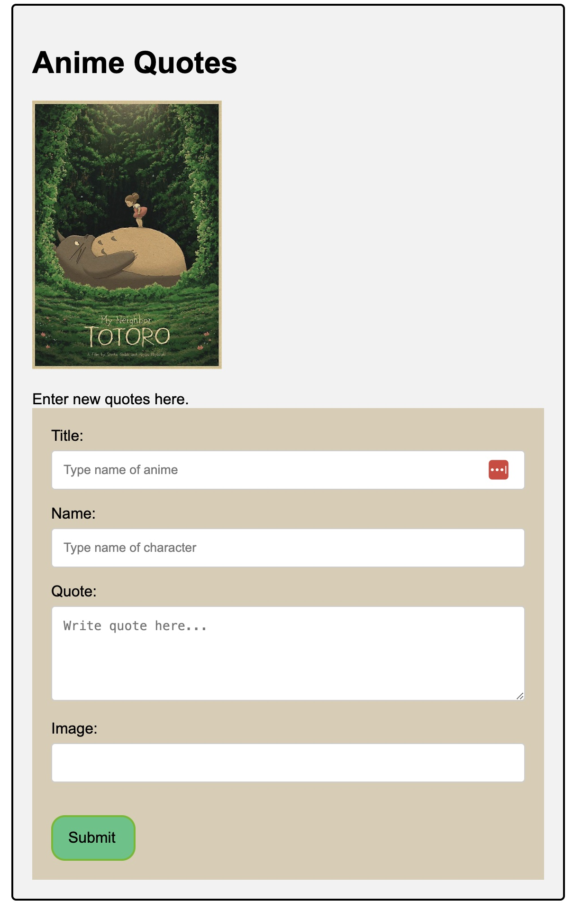

# SBA 318: Express Server Application
Version 1.0, 07/25/23

### Introduction
This assessment measures your understanding of Node and Express and your capability to implement their features in a practical manner. You have creative freedom in the topic, material, and purpose of the web application you will be developing, so have fun with it! However, remember to plan the scope of your project to the timeline you have been given.

### Objectives
Create a server application with Node and Express.
Create a RESTful API using Express.
Create Express middleware.
Use Express middleware.
Use a template engine to render views with Express.
Interact with a self-made API through HTML forms.

## My Program Description: Anime Quote RESTful API
This API has anime quotes stored in four data collections. 

Three of the data collections are in a structured organization.
| shows.mjs  | characters.mjs | quotes.mjs    |
| :--------- | :-----------   | :--------     |
| id         | id             | id            |
| title      | name           | characterId   |
| year       | showId         | quote         |
|            | img            |               |

One of the data collections is for the web form.
| formQuotes.mjs |
|----------------|
| id             |
| title          |
| name           |
| quote          |
| image          |

### API URLS and Method Capabilities
Using Thunder Client you can do the following methods within each
of the URLs
| URL         | C | R | U | D | Query |
|-------------|---|---|---|---|-------|
| /           | N | Y | N | N | N     |
| /quotes     | N | Y | N | N | N     |
| /characters | N | Y | N | N | N     |
| /show       | Y | Y | Y | Y | Y     |
| /formQuotes | Y | Y | Y | Y | N     |
               
| VERB   | PATH                                | DESCRIPTION                             |
|--------|-------------------------------------|-----------------------------------------|
| GET    | /                                   | Home Page w/ Directory                  |
| GET    | /quotes/                            | Index of quotes with characterID        |
| GET    | /quotes/:id                         | Select quote by id                      |
| DELETE | /quotes/:id                         | Delete quote by id.                     |
| GET    | /characters                         | Index of characters with showID         |
| GET    | /characters/:id                     | Select character by id                  |
| GET    | /shows                              | Index of shows and year they were realised |
| GET    | /shows/:id                          | Select show by id                       |
| PUT    | /shows/:id                          | Update show object by id                |
| DELETE | /shows/:id                          | Delete show by id                       |
| GET    | /shows/search?                      | Querie show by title OR year (not by both)   |
| GET    | /form-quotes                        | Index quote form data for form         |
| GET    | /form-quotes/:id                    | Select quote fo        |
| POST   | /form-quotes                        | Index quote form data for form         |
| PUT    | /form-quotes/:id                    | Update quote form data by id           |
| DELETE | /form-quotes/:id                    | Delete quote form data by id         |

## Anime Quotes Form
This is located in the following location:
http://localhost:3000/form

Enter the following fields:
Title: 
Name: 
Quote:
Image:

This will produce a simple card with the image of the character, title of the anime the character is from the anime, quote and image.
All entries are required except for image. 

