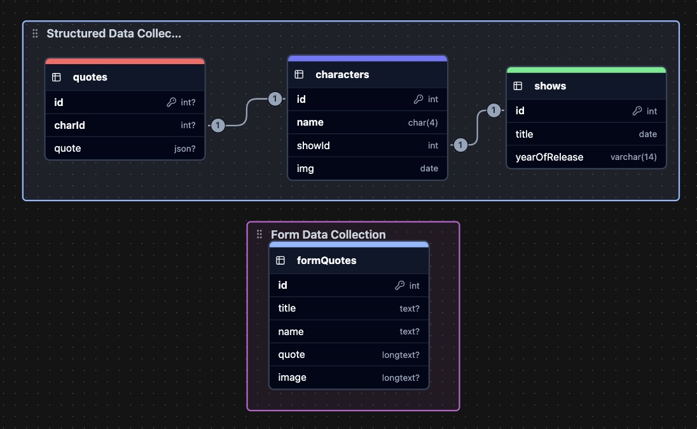

# SBA 318: Express Server Application
Version 1.0, 07/25/23

### Introduction
This assessment measures your understanding of Node and Express and your capability to implement their features in a practical manner. You have creative freedom in the topic, material, and purpose of the web application you will be developing, so have fun with it! However, remember to plan the scope of your project to the timeline you have been given.

### Objectives
Create a server application with Node and Express.
Create a RESTful API using Express.
Create Express middleware.
Use Express middleware.
Use a template engine to render views with Express.
Interact with a self-made API through HTML forms.

## My Program Description: Anime Quote RESTful API
This API has anime quotes stored in four data collections. 

Three of the data collections are in a structured organization.
| shows.mjs  | characters.mjs | quotes.mjs    |
| :--------- | :-----------   | :--------     |
| id         | id             | id            |
| title      | name           | characterId   |
| year       | showId         | quote         |
|            | img            |               |

One of the data collections is for the web form.
| formQuotes.mjs |
|----------------|
| id             |
| title          |
| name           |
| quote          |
| image          |

### API URLS and Method Capabilities
Using Thunder Client you can do the following methods within each
of the URLs
| URL         | C | R | U | D | Query |
|-------------|---|---|---|---|-------|
| /           | N | Y | N | N | N     |
| /quotes     | N | Y | N | N | N     |
| /characters | N | Y | N | N | N     |
| /show       | Y | Y | Y | Y | Y     |
| /formQuotes | Y | Y | Y | Y | N     |
               
| VERB   | PATH                                | DESCRIPTION                             |
|--------|-------------------------------------|-----------------------------------------|
| GET    | /                                   | Home Page w/ Directory                  |
| GET    | /quotes/                            | Index of quotes with characterID        |
| GET    | /quotes/:id                         | Select quote by id                      |
| DELETE | /quotes/:id                         | Delete quote by id.                     |
| GET    | /characters                         | Index of characters with showID         |
| GET    | /characters/:id                     | Select character by id                  |
| GET    | /shows                              | Index of shows and year they were realised |
| GET    | /shows/:id                          | Select show by id                       |
| PUT    | /shows/:id                          | Update show object by id                |
| DELETE | /shows/:id                          | Delete show by id                       |
| GET    | /shows/search?                      | Querie show by title OR year (not by both)   |
| GET    | /form-quotes                        | Index quote form data for form         |
| GET    | /form-quotes/:id                    | Select quote fo        |
| POST   | /form-quotes                        | Index quote form data for form         |
| PUT    | /form-quotes/:id                    | Update quote form data by id           |
| DELETE | /form-quotes/:id                    | Delete quote form data by id         |

### Requirements

[x] Create and use at least two pieces of custom middleware.

[x] Create and use error-handling middleware.

[x] Use at least three different data categories (e.g., users, posts, or comments).
    In this case (characters, shows, quotes)

[x] Utilize reasonable data structuring practices.

[x] Create GET routes for all data that should be exposed to the client.

[x] Create POST routes for data, as appropriate. At least one data category should allow for client creation via a POST request.

[x] Create PATCH or PUT routes for data, as appropriate. At least one data category should allow for client manipulation via a PATCH or PUT request.

[x] Create DELETE routes for data, as appropriate. At least one data category should allow for client deletion via a DELETE request.

[x] Include query parameters for data filtering, where appropriate. At least one data category should allow for additional filtering through the use of query parameters.
Note: DO NOT use API keys; this makes it more difficult for instructors to grade finished projects efficiently.

[ ] Use simple CSS to style the rendered views.
Note: This is not a test of design; it is a test of serving static files using Express. The CSS can be very simple.

[ ] Include a form within a rendered view that allows for interaction with your RESTful API.

[x] Utilize reasonable code organization practices.

[x] Ensure that the program runs without errors (comment out things that do not work, and explain your blockers - you can still receive partial credit).

[x] Commit frequently to the git repository.

[x] Include a README file that contains a description of your application.

[ ] Level of effort displayed in creativity, presentation, and user experience.

### Bonus Objectives
[ ] Include a practical usage of regular expressions within route paths.
Note: A forced, arbitrary usage of this technique will not earn you any bonus credit. This must be practical and sensible in order to be considered for credit.

[ ] Research and effectively use at least one third-party Node package for practical, sensible purposes.
This cannot be a package that has been used in examples and lesson materials thus far. Step outside the box and be creative! 

